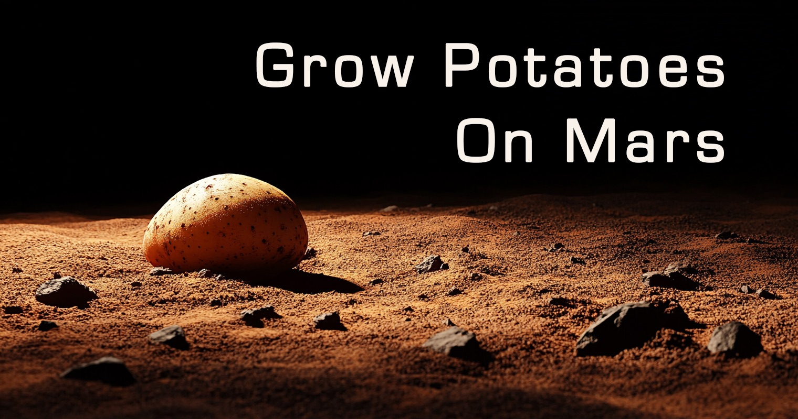

# 🥔 Martian Potato

A meta-aware idle game about colonizing Mars with potatoes. From manual farming to quantum technology, experience a witty journey of automation, resource management, and potato-powered innovation. The game knows you're playing it - and it's not afraid to tell you why.

## 🎮 Play Now

## ⭐ Support the Game

If you enjoy Martian Potato, consider:
- ⭐ Starring this repository
- 📝 [Rating on itch.io](https://martianpotato.com/?utm_source=github&utm_medium=readme&utm_campaign=rating)
- 🎯 [Reviewing on incremental.db](https://martianpotato.com/?utm_source=github&utm_medium=readme&utm_campaign=review)

## 🌟 Features

- 🚜 Progress from manual farming to quantum automation
- 🤖 Multiple automation systems and devices
- 🧪 Technology progression from basic tools to quantum computers
- 💭 Meta-commentary on game design psychology
- 🏆 Achievement system that questions why you care about achievements
- 📊 Real-time resource monitoring
- 🥔 A surprising amount of potato-based philosophy

## 🐛 Bug Reports & Contributions

- 🐞 [Submit an Issue](https://github.com/yourusername/martianpotato/issues)
- 🔧 [Submit a Pull Request](https://github.com/yourusername/martianpotato/pulls)

Please read our [Contributing Guidelines](CONTRIBUTING.md) before submitting any changes.

## 📜 License

This project is licensed under the [Creative Commons Attribution-NonCommercial-NoDerivatives 4.0 International License](LICENSE.md). This means you can:
- Share and play the game
- View the source code for learning purposes

But you cannot:
- Use the code or assets commercially
- Modify and redistribute the code
- Create derivative works

For commercial use, please contact the developer.

## 🌟 Credits

- Game Development: Ryan Mioduski
- Art: Generated with Midjourney
- Special thanks to our community of players and contributors!

---

Made with ❤️ and 🥔
